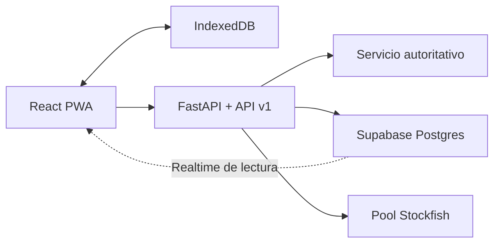

# Academia Estratégica Cuántica

Evolución de **Gambito de Dama Cuántico** hacia una PWA educativa bilingüe y accesible para aprender y jugar ajedrez clásico y cuántico. El reglamento anterior se conserva en `classic` y `quantum-standard`; la nueva mecánica vive de forma aislada en `quantum-coherence`.

## Qué incluye

- Academia local-first con 2 rutas, 16 módulos y 64 actividades validadas con Zod.
- Diagnóstico opcional, recomendación adaptativa, dominio por habilidad, repaso espaciado, cuaderno de errores, reto diario y Puzzle Sprint de 3, 5 o 10 minutos.
- Puntuación 0–100, dominio `0,7 × anterior + 0,3 × intento`, desbloqueo por dominio y resoluciones independientes, y escalera de cuatro pistas.
- Ajedrez clásico, cuántico estándar y variante **Coherencia limitada** con capacidades 2, 4 o 6.
- IA cuántica determinista en Web Worker, cancelable, con semilla y presupuesto por dificultad.
- Vista previa de resultados probabilísticos antes de capturas complejas.
- Replays con acciones neutrales al idioma, análisis posterior y laboratorio ramificable «¿Qué habría pasado si…?».
- Invitado persistente, IndexedDB, sincronización append-only idempotente y vinculación opcional por enlace mágico o Google.
- PWA instalable con shell y contenido educativo offline, actualización diferida durante partidas.
- Temas claro, oscuro y sistema, alto contraste, movimiento reducido explícito, piezas/tableros seleccionables, narración ajustable, sonido y vibración opcional.
- API v1 para progreso, coach, retos, replays, telemetría consentida, perfil y partidas autoritativas.
- Migraciones Supabase versionadas con RLS y escritura de estados de partida reservada al servicio.

El contenido educativo esencial, las reglas, el tutor y los retos no dependen de una membresía. La integración de apoyo solo admite cosméticos accesibles y está apagada por defecto.

## Rutas de la PWA

| Ruta | Uso |
|---|---|
| `/` | Inicio adaptado a usuario nuevo o recurrente |
| `/learn` | Mapa de habilidades, diagnóstico, repaso y reto diario |
| `/learn/:lessonId` | Actividad profunda con versión de contenido fijada |
| `/learn/sprint/:minutes` | Puzzle Sprint de 3, 5 o 10 minutos |
| `/play` | Partida activa local o contra IA |
| `/online` | Lobby online de transición |
| `/join/:code` | Unión mediante código; `?room=` se redirige aquí |
| `/profile` | Cuenta, exportación, borrado y apoyo opcional |
| `/rules` | Referencia de reglas |

## Reglas y motores

### Modos estables

- `classic`: reglas completas mediante `chess.js` y Stockfish para IA/análisis.
- `quantum-standard`: split, fusión, medición, túnel y enroque cuántico sin cambio de contrato.
- En ajedrez cuántico, capturar el rey gana y no disponer de acciones legales produce tablas.

### Coherencia limitada

- Cada jugador parte de una capacidad configurable de 2, 4 o 6; el valor competitivo previsto es 4.
- Cada rama adicional consume una unidad.
- Un entrelazamiento de túnel activo consume una unidad adicional.
- El enroque cuántico requiere dos unidades libres.
- Fusiones y colapsos liberan capacidad; no hay regeneración ni gasto permanente.
- La UI comunica uso y disponibilidad con número, segmentos y etiqueta accesible.

### Tutor y análisis

- Clásico: Stockfish MultiPV, pérdida en centipawns y detectores deterministas de captura, jaque y seguridad del rey.
- Cuántico: enumeración legal y evaluación reproducible de material esperado, seguridad, ramas y coherencia.
- Las explicaciones se resuelven mediante claves localizadas; las posiciones no se envían a modelos generativos.

## Arquitectura



- Frontend: React 18, TypeScript, Vite, Tailwind, React Router, zod/mini, chess.js 1.x e IndexedDB.
- Backend: FastAPI, contratos Pydantic estrictos, repositorios de progreso/partidas y pool acotado de Stockfish.
- Datos: migraciones SQL versionadas bajo `supabase/migrations`.
- Entrega: cada bloque de riesgo se controla mediante feature flags.

El adaptador API incluido conserva datos en memoria para desarrollo y pruebas. Las migraciones definen el esquema de producción; conectar el repositorio del servicio a un proyecto Supabase real es una tarea de despliegue, no una precondición para el modo local-first.

## Instalación local

Requisitos: Node.js 20+, Python 3.12+ y Stockfish en `PATH` o dentro de `engine/`. Para trabajar sin Stockfish se puede usar `SKIP_STOCKFISH=1`.

**Linux / macOS**

```bash
python3 -m venv .venv
source .venv/bin/activate
pip install -r requirements-dev.txt

(cd engine/stockfish/src && make -j"$(nproc)" build ARCH=x86-64)   # opcional
(cd frontend && npm ci && npm run build)

python server.py
```

**Windows (PowerShell)**

```powershell
py -m venv .venv
.venv\Scripts\Activate.ps1
pip install -r requirements-dev.txt

Set-Location frontend
npm ci
npm run build
Set-Location ..

python server.py
```

La aplicación compilada queda servida en `http://localhost:8000`. Para hot reload, `cd frontend && npm run dev` abre `http://localhost:5173` y proxifica `/api` y `/music` al backend.

### Docker

```bash
docker build -t gambito .
docker run --rm -p 8000:8000 gambito
```

La imagen compila Stockfish (descarga su red NNUE y verifica el binario con `bench`), construye el frontend y ejecuta el servidor como usuario sin privilegios. Las variables públicas de Vite se pasan con `--build-arg VITE_SUPABASE_URL=... --build-arg VITE_SUPABASE_ANON_KEY=...`.

## Configuración

Copiar `.env.example` para el backend/despliegue y `frontend/.env.example` para las variables de compilación. No se versionan secretos.

Variables principales:

- `SUPABASE_URL` y `SUPABASE_PUBLISHABLE_KEY`: verificación de JWT en la API.
- `VITE_SUPABASE_URL` y `VITE_SUPABASE_ANON_KEY`: Auth/Realtime desde el navegador.
- `STOCKFISH_POOL_SIZE` y `STOCKFISH_QUEUE_TIMEOUT`: capacidad y espera del pool.
- `RATE_LIMIT_ENGINE_PER_MINUTE`, `RATE_LIMIT_ANALYTICS_PER_MINUTE`, `RATE_LIMIT_API_PER_MINUTE`: límites por IP (`RATE_LIMIT_ENABLED=0` los desactiva).
- `FORWARDED_ALLOW_IPS`: proxies de confianza para `X-Forwarded-For` (`*` detrás de Render o Docker con proxy delante).
- `CORS_ORIGINS`: orígenes permitidos separados por comas; vacío significa solo mismo origen.
- `VITE_SUPPORTER_CHECKOUT_URL`: URL HTTPS de Stripe Checkout; solo se usa con su flag activo.
- `FEATURE_AUTHORITATIVE_QUANTUM`: mantiene apagadas las acciones cuánticas online hasta completar el núcleo compartido y la prueba de carga.

Los valores y defaults completos están en los dos archivos de ejemplo.

## Seguridad

- El servidor solo sirve archivos que, una vez resueltos, quedan dentro de `frontend/dist` o `music/`.
- Los endpoints que consumen Stockfish, el coach, la analítica y la API v1 tienen límite de peticiones por IP (en memoria; con varias instancias hay que moverlo a un almacén compartido).
- Los payloads cuánticos están acotados (piezas, casillas, universos, profundidad y combinaciones exploradas).
- En el lobby online heredado, unirse a una sala pasa por la RPC `join_room_by_code`: las salas en espera no son legibles por terceros. Un trigger impide robar asientos, retroceder la versión, mover en el turno del rival o elegir la semilla de medición, que ahora genera Postgres. El modelo sigue siendo cliente-autoritativo; el competitivo debe usar `matches` y la API autoritativa.

## Migraciones Supabase

Las migraciones crean perfiles, eventos de progreso, dominio, logros, retos, partidas, eventos de partida, ratings, entitlements, analítica consentida, replays terminados y las RPC del lobby (`join_room_by_code`, `abandon_room`, `cleanup_stale_rooms`). La escritura de progreso y partidas se reserva al rol de servicio; el cliente autenticado recibe políticas de lectura sobre sus propios datos.

```bash
npx supabase@2.113.0 db reset   # requiere Docker
```

`npm test` aplica todas las migraciones sobre Postgres embebido (PGlite) y comprueba las políticas de las salas online, así que el SQL se valida en CI aunque no haya Docker.

## Verificación

```bash
# Backend
ruff check .
SKIP_STOCKFISH=1 pytest -q

# Frontend
cd frontend
npm run lint          # ESLint sin avisos permitidos
npm run typecheck
npm test              # unitarias + migraciones sobre PGlite
npm run build
npm run check:bundle  # entrada inicial < 150 kB gzip

# E2E
npm run e2e           # Chromium, Firefox y WebKit
npm run e2e:pwa       # build PWA real y recarga offline
npm run e2e:flags     # gates de entrega apagados
```

Si el Chromium instalado no coincide con la versión de Playwright, `PW_CHROMIUM_PATH=/ruta/a/chrome` lo usa en lugar de descargar otro.

CI ejecuta lint, typecheck, pruebas unitarias, build, presupuesto de bundle, E2E en Chromium (más PWA y flags), ruff y pytest.

Baseline verificada de esta entrega:

- 82 pruebas unitarias frontend (incluidas las de migraciones SQL).
- 32 pruebas backend.
- 22 recorridos E2E en Chromium, más dos pruebas PWA de producción y una de gates apagados.
- Entrada crítica de ~116 kB gzip (JS + CSS); precarga PWA de ~945 kB.

## Estado de lanzamiento

La experiencia local, Academia, PWA, Coherencia limitada local/IA, replays y análisis están implementados. El online cuántico autoritativo y el competitivo aún no se exponen; el servidor mantiene su gate cuántico cerrado hasta completar núcleo compartido, carga y beta. La membresía sí está preparada tras un flag y una URL válida de Checkout. Véase [docs/STATUS.md](docs/STATUS.md) y el detalle en [docs/IMPLEMENTACION_Y_PENDIENTES.txt](docs/IMPLEMENTACION_Y_PENDIENTES.txt).

## Licencia

MIT
